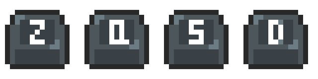

<div align = "center">

</div>

ZQSD is a platformer game developped as a java software projet at [ENSSAT](https://enssat.fr/) in 2025. The goal of this project is mainly to learn how to use Java while still having fun with it. As so the game uses only Swing and no external libraries. 

**Bellow, you'll find an installation guide to install the project.** But feel free to fork the project and make your own game with it. 


# 📥 Installation Guide 

For now the game is usable via the command line or the Makefile. 

## 📂 Contents
- [Prerequisite](#-prerequisite)
- [Installation](#-installation)
- [Usage](#-usage)
- [Contributing](#-contributing)
- [License](#-license)


## 📋 Prerequisite

Java 8 or higher is required to run the game. You can check your version with the following command:

```bash
java -version
```
If you don't have Java installed, you can download it from the [official website](https://www.oracle.com/java/technologies/javase-jdk17-downloads.html).


## 🧮 Installation
Clone the repository:

```bash
git clone git@github.com:GHero0/ZQSD.git
```

## 🎮 Usage

1. Navigate to the project directory:

```bash
cd ZQSD
```

2. Compile the project using the Makefile:

```bash
make compile
```

3. Run the game:

If you are using Linux, you can run the game with the following command:
```
make run-linux
```

If you're on Windows, the following command will run the game:
```bash
make run-windows
```

Alternatively, you can use:
```
make run
```

## 🤝 Contributing

Contributions are welcome! If you have suggestions for improvements or new features, feel free to open an issue or submit a pull request.
To contribute to the project, follow these steps:
1. Fork the repository.
    Click the "Fork" button at the top right of the repository page.
2. Create a new branch for your feature or bug fix:
```bash
git checkout -b feature/your-feature-name
```
3. Make your changes and commit them:
```bash
git commit -m "Add your feature or fix"
```
4. Push to the branch:
```bash
git push origin feature/your-feature-name
```
5. Open a pull request to the main branch of the original repository.
6. Describe your changes and why they should be merged.


## 📄 License

This project is licensed under the GNU General Public License v3.0. See the [LICENSE](LICENSE) file for details.

🤧 The assets are still in development. For now the game uses non-free assets. The game is not intended for commercial use and is only a school project.


